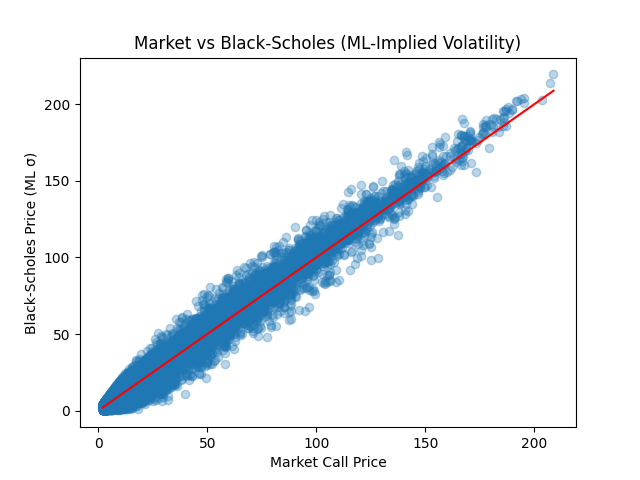
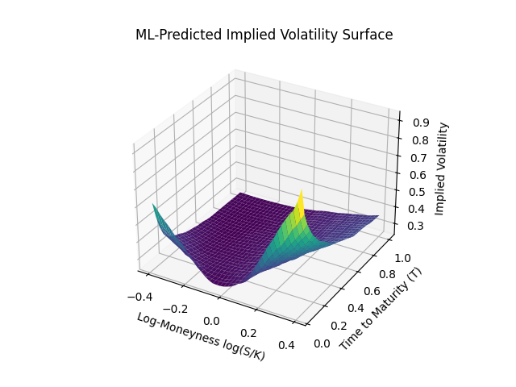
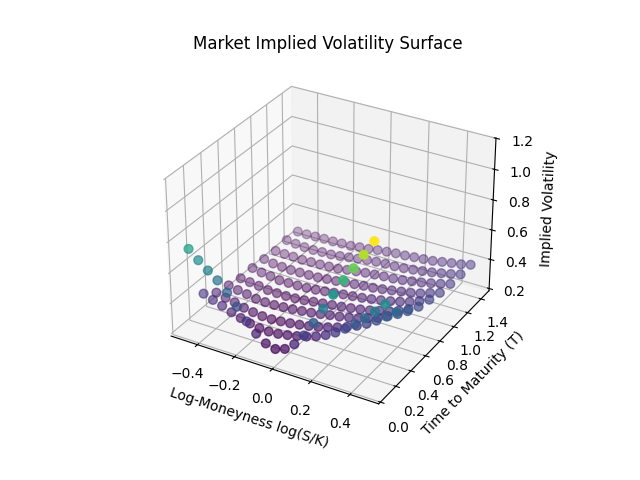
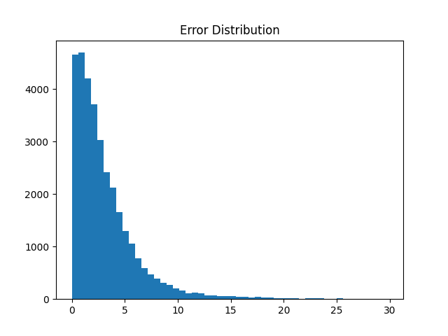
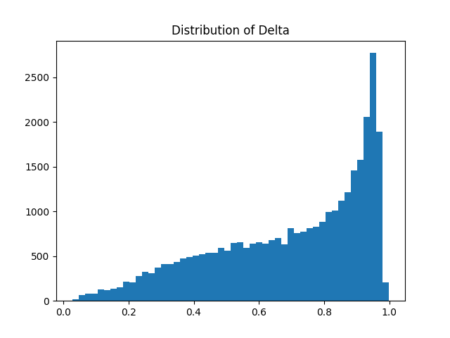

# ML-Based Implied Volatility Surface Modeling and Option Pricing

## Overview

This project focuses on modeling the implied volatility surface of options using machine learning techniques and integrating the predicted volatility into the Black-Scholes framework for option pricing.

Traditional Black-Scholes assumes constant volatility, which is unrealistic in practice. This work aims to learn the volatility surface directly from market data and improve pricing accuracy using data-driven methods.

---

## Market vs Black Scholes (ML Implied Volatility)

### Market vs Model Price

---

## Methodology

### Data Processing
- Cleaned options data and removed invalid or extreme values
- Converted Days to Expiry (DTE) into time to maturity (T)
- Filtered unrealistic implied volatility ranges

### Feature Engineering
The following features were used to capture the structure of the volatility surface:
- Log-moneyness: log(S / K)
- Time to maturity (T)
- S / K ratio
- Square root of time (√T)
- Time squared (T²)
- Squared log-moneyness

---

### Models Used
Several models were evaluated:
- Linear Regression
- Decision Tree
- Random Forest
- Gradient Boosting
- XGBoost
- Neural Network (MLP)

Hyperparameter tuning was applied to tree-based models to improve performance.

### Implied Volatility Surface

### Market Volatility Surface

---

### Ensemble Learning
An ensemble model combining Random Forest, Neural Network, and XGBoost was implemented. Weighted averaging was used to combine predictions, improving overall performance and stability.

---

### Option Pricing
Predicted implied volatility was used within the Black-Scholes formula to compute option prices.

---

### Smoothing
A rolling smoothing technique was applied to the predicted volatility surface to reduce noise and improve stability.

---

## Results

The final ensemble model achieved:

- RMSE: ~0.1338  
- R² Score: ~0.882  
- Mean Absolute Error: ~3.09  
- Weighted Error: ~0.21  
- Price Correlation: ~0.99  

The model captures the volatility smile effectively and produces option prices closely aligned with market data.

### Error Distribution

---

## Greeks

Delta was computed using the Black-Scholes formulation with ML-predicted volatility. The resulting distribution:
- Remains within theoretical bounds (0 to 1)
- Shows smooth variation across moneyness
- Demonstrates stable and realistic behavior

- ### Delta Visualization

---

## Visualizations

The project includes:
- Market vs Model price comparison
- Implied volatility surface (market vs ML)
- Error analysis plots
- Delta distribution and surface visualization

---

## Limitations

- The model does not explicitly enforce arbitrage constraints
- Monotonicity violations are observed in option prices
- Machine learning models optimize prediction accuracy rather than financial consistency

---

## Future Work

- Incorporating arbitrage-free constraints into modeling
- Exploring SVI or spline-based volatility surface fitting
- Extending to time-series forecasting of volatility
- Improving consistency across strikes and maturities

---

## How to Run

1. Install dependencies:
# ML-Based Implied Volatility Surface Modeling and Option Pricing

## Overview

This project focuses on modeling the implied volatility surface of options using machine learning techniques and integrating the predicted volatility into the Black-Scholes framework for option pricing.

Traditional Black-Scholes assumes constant volatility, which is unrealistic in practice. This work aims to learn the volatility surface directly from market data and improve pricing accuracy using data-driven methods.

---

## Methodology

### Data Processing
- Cleaned options data and removed invalid or extreme values
- Converted Days to Expiry (DTE) into time to maturity (T)
- Filtered unrealistic implied volatility ranges

### Feature Engineering
The following features were used to capture the structure of the volatility surface:
- Log-moneyness: log(S / K)
- Time to maturity (T)
- S / K ratio
- Square root of time (√T)
- Time squared (T²)
- Squared log-moneyness

---

### Models Used
Several models were evaluated:
- Linear Regression
- Decision Tree
- Random Forest
- Gradient Boosting
- XGBoost
- Neural Network (MLP)

Hyperparameter tuning was applied to tree-based models to improve performance.

---

### Ensemble Learning
An ensemble model combining Random Forest, Neural Network, and XGBoost was implemented. Weighted averaging was used to combine predictions, improving overall performance and stability.

---

### Option Pricing
Predicted implied volatility was used within the Black-Scholes formula to compute option prices.

---

### Smoothing
A rolling smoothing technique was applied to the predicted volatility surface to reduce noise and improve stability.

---

## Results

The final ensemble model achieved:

- RMSE: ~0.1338  
- R² Score: ~0.882  
- Mean Absolute Error: ~3.09  
- Weighted Error: ~0.21  
- Price Correlation: ~0.99  

The model captures the volatility smile effectively and produces option prices closely aligned with market data.

---

## Greeks

Delta was computed using the Black-Scholes formulation with ML-predicted volatility. The resulting distribution:
- Remains within theoretical bounds (0 to 1)
- Shows smooth variation across moneyness
- Demonstrates stable and realistic behavior

---

## Visualizations

The project includes:
- Market vs Model price comparison
- Implied volatility surface (market vs ML)
- Error analysis plots
- Delta distribution and surface visualization

---

## Limitations

- The model does not explicitly enforce arbitrage constraints
- Monotonicity violations are observed in option prices
- Machine learning models optimize prediction accuracy rather than financial consistency

---

## Future Work

- Incorporating arbitrage-free constraints into modeling
- Exploring SVI or spline-based volatility surface fitting
- Extending to time-series forecasting of volatility
- Improving consistency across strikes and maturities

---

## How to Run

1. Install dependencies:
pip install -r requirements.txt
2. Run the notebook:
- Open the Jupyter notebook and execute all cells

3. Use saved models:
- Load `.pkl` files using joblib for inference

---

## Files

- `notebook.ipynb` – main implementation  
- `final_results.csv` – processed dataset with predictions  
- `rf_model.pkl`, `xgb_model.pkl`, `nn_model.pkl` – trained models  
- `scaler.pkl` – feature scaler  
- `ensemble_weights.pkl` – ensemble configuration  

---

## Conclusion

This project demonstrates that machine learning models can effectively learn the implied volatility surface and significantly improve option pricing compared to traditional assumptions. It also highlights the importance of incorporating financial constraints for real-world applicability.
